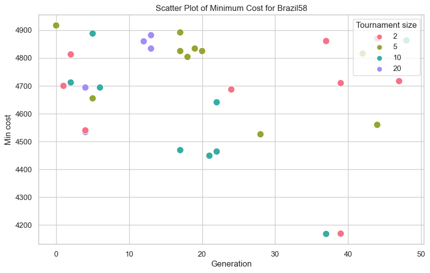
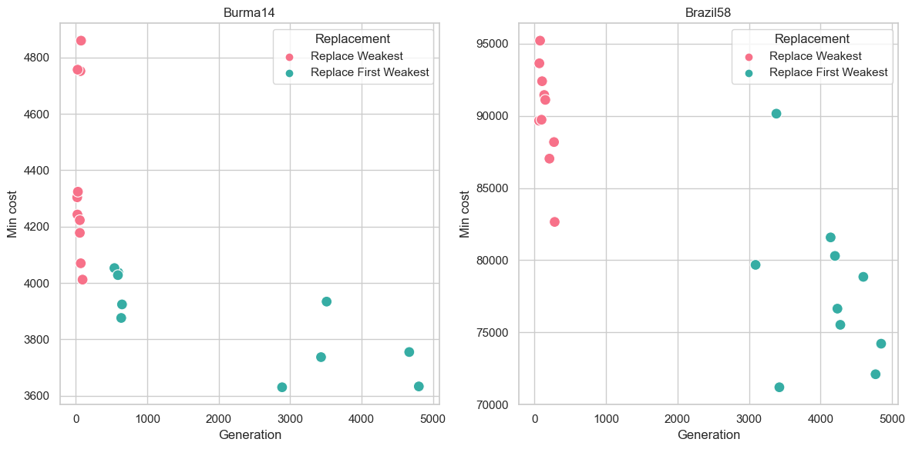
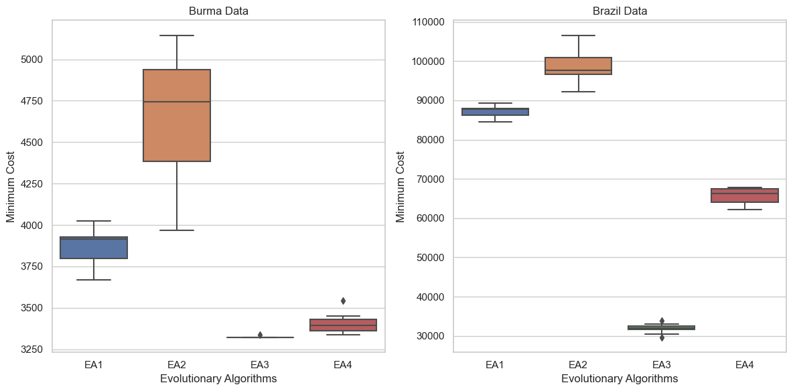

# Solving the Travelling Salesman Problem using Genetic Algorithms
## Description

This project looks to solve the Travelling Salesman Problem using a Genetic Algorithm. It includes various different operators, where different combinations attain different results. My personal experimentation is documented in 'Report.pdf' which includes a brief background on the task. For this Project, I test my algorithms on the Burma14 and Brazil58 data sets which are both XML files.  

## Usage

Upon opening the Genetic Algorithm Programme, you are presented with multiple cells. Run the following in order to create the neccesary functions for solving the TSP:

- CREATE POPULATION functions 
    - This cell represents the data initialisation
    -  It includes the necessary functions to extract the data from the given XML file, and store it in a database of the following structure

    | Index | Population | Cost               |
    |---------|----------|---------------------|
    | 1       | [1,2,3,4,...,N]    |  1234  |
    - Where 'Population' contains lists of different routes (city indexes) and 'Cost' an integer value of the cost of that rows route.
    - We use a pd.Dataframe for multiple reasons, including ease of access, ease to update and later ease to store and plot.

-  MUTATIONS functions 
    - This cell contains functions for the multiple different operators and mutations within the program, including:
        - Tournament
        - Single Point Crossover
        - Ordered Crossover
        - Inversion Mutation
        - Swap Mutation
        - Replace Weakest
        - Replace First Weakest
    - See the report pdf for explanation behind each operator.

- TERMINATION CRITERIA cells
    - This cell is the function to run the EA. It follows the given structure:
        1. Use tournament selection twice to select two parents
        2. Apply crossover on selected parents, generate two children
        3. Run a mutation on children
        4. Evlaute fitness of solution
        5. Run replacement function
        6. If a termination criterion has been reached, then stop. Otherwise return to step 2.
    - We have two different cells for each termination criteria, each storing data differently:
        - TERMINATION CRITERIA - Each generation
            - This is used for the convergence plots. It stores best result for each generation
        - TERMINATION CRITERIA - New best
            - This is used for the scatter plots. It stores the best current result over all generations
    - For this, we suggest using the latter to obtain the plots in our report.
    

### Controls

The following cell is is used as the key testing feature. Here, it contains all the operators previously defined, generates the initial population and contains adjustable features such as save file names.
```python
# CONTROLS FOR EA 

#  Generate initial population
xml_file = 'burma14.xml'  # Replace with the actual XML file path
population_size = 100
seed_value = 1
df, node_cost = initialize_population(xml_file, population_size, seed_value)

# Controls for evolution (first item in list used for default)
max_rounds = 50
tournament_size= [2, 5, 10, 20] # List if testing different tournament sizes
mutations = [swap_mutation, inversion_mutation]  # List if testing different mutation strategies
number_of_swaps = [0, 2, 5]  # List if testing different number of swaps
crossovers = [single_point_crossover, ordered_crossover]   # List if testing different crossover strategies
replacements = [replace_weakest, replace_first_weakest] # List if testing different replacement strategies

# Save file - change as needed
save_file = 'burma_replace_results.csv'
save_plot = 'burma_replace_plot.png'
```
As mentioned, this project utilised either the 'burma14.xml' or the 'brazil58.xml'.

### Results

We have multiple results cells. Run an individual cell to obtain the results for a given feature. We include:
- Tournament size test
- Swap Mutation test: Inverse, Single swap, Multiple swap
- Crossover test: Single-point crossover, Ordered crossover
- Replacement test: Replace weakest, Replace first weakest

For each different combination of operators, we run 10 iterations. These results are stored in a csv file, with the name defined in the controls cell

### Plots

We also have multiple plot cells. Run either cell, adjusting the save_file varaible to whichever csv file desired. Each CSV 'save_file' will contain testing results for either burma or brazil
- 'Individual Plots'
  - Plots an indivdual scatter plot for the recording of best cost data. For example:
  
- 'Joint Plots'
  - Plots a joint plot, which shares the same x axis. For example:
  

### Best EA cells. 

These final last two cells are used to test four different EA's that contain different combinations of operators. This is for the conclusion in the report. In summary this:
- Returns csv for whichever country dataset loaded in
- Best EA - plot to evaluate perfromance of diff EA's
- Creates the boxplot of the best EA results



# Author

Charlie Wilkinson - MSc Data Science and AI


